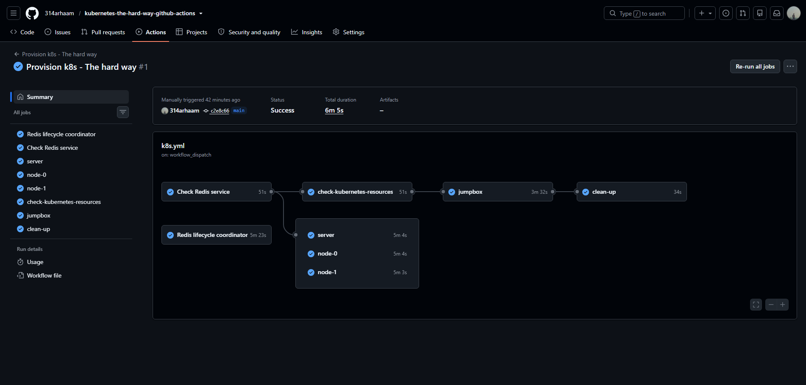
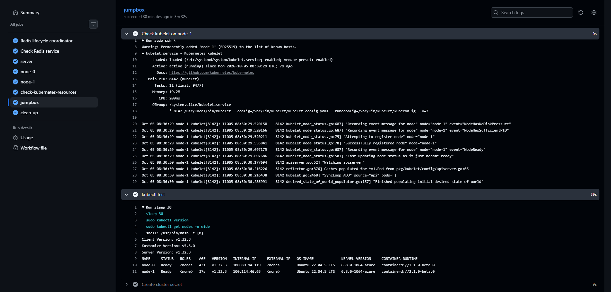

# Kubernetes The Hard Way on GitHub Actions

This repository runs **Kubernetes The Hard Way** on ephemeral GitHub-hosted runners.

Instead of provisioning four permanent VMs, the workflow uses GitHub Actions runners as temporary machines, connects them through **Tailscale**, and then performs the Kubernetes The Hard Way steps across those runners.

The goal is not to provide a production Kubernetes installer. It is an experiment and learning environment for understanding how Kubernetes components are bootstrapped, configured, connected, and verified on separate machines.

The implementation is based on:

- [Kubernetes The Hard Way](https://github.com/kelseyhightower/kubernetes-the-hard-way)
- [Testing data platforms by getting more out of GitHub Actions](https://medium.com/data-engineer-things/testing-data-platforms-by-getting-more-out-of-github-actions-bacb32699b6a)

## Results

### Workflow



### Kubelet service status



### Nginx pod log


## Architecture

The workflow creates separate GitHub-hosted runners for the Kubernetes machines:

```text
                   GitHub Actions
                        |
        +---------------+---------------+
        |               |               |
     jumpbox          servers         workers
                    server-0...       node-0...
```

All machines join the same Tailscale tailnet and are addressed using predictable MagicDNS names:

```text
server-0
node-0
node-1
```

The Kubernetes layout follows Kubernetes The Hard Way:

- `jumpbox` — orchestration and administration
- `server-N` — etcd and Kubernetes control-plane nodes
- `node-N` — Kubernetes worker nodes

## How It Works

Normally, a GitHub-hosted runner exists only for the duration of its job. This repository keeps several jobs alive at the same time so their runners can behave like machines in a temporary infrastructure environment.

Each infrastructure job:

1. Starts on its own GitHub-hosted runner.
2. Connects the runner to Tailscale.
3. Assigns it a predictable hostname.
4. Enables SSH access.
5. Keeps the job and runner alive while the rest of the workflow configures the cluster.

Other jobs can then reach these machines through the Tailnet.

```bash
ssh root@server-0
ssh root@node-0
```

This makes independent GitHub-hosted runners behave like machines on the same private network.

## Kubernetes The Hard Way

The workflow automates the same general sequence used by the upstream project:

```text
Jumpbox
   |
   +--> Compute resources
   +--> Certificate Authority
   +--> Kubernetes configuration files
   +--> Data encryption key
   +--> etcd
   +--> Kubernetes control plane
   +--> Kubernetes workers
   +--> kubectl configuration
   +--> Pod network routes
   +--> Verification / smoke tests
```

The upstream project is intentionally designed for learning rather than as a production-ready Kubernetes deployment. This repository keeps that purpose but replaces manually provisioned machines with ephemeral GitHub Actions runners.

## Tailscale

Tailscale provides the private network between the GitHub runners.

Without it, each GitHub-hosted runner is an isolated ephemeral VM. By joining all runners to the same tailnet, Redis-style coordination, SSH, Kubernetes control-plane traffic, and worker-to-worker communication can happen over private Tailscale addresses without exposing services directly to the public internet.

The workflow uses the official Tailscale GitHub Action:

```yaml
- name: Connect to Tailscale
  uses: tailscale/github-action@v4
  with:
    oauth-client-id: ${{ secrets.TS_OAUTH_CLIENT_ID }}
    oauth-secret: ${{ secrets.TS_OAUTH_SECRET }}
    tags: tag:ci
    hostname: ${{ matrix.node.name }}
```

The workflow matrix creates `server-N` and `node-N` Tailscale hostnames from the requested master and worker counts.

## Create the `tag:ci` Tag

Open the **Tailscale Admin Console -> Access controls** and define a tag for the CI runners.

A minimal example:

```json
{
  "tagOwners": {
    "tag:ci": []
  }
}
```

An empty owner list means Tailscale Owners, Admins, and Network Admins can apply the tag.

For a simple lab environment, you can also allow CI nodes to communicate with other devices in the tailnet:

```json
{
  "tagOwners": {
    "tag:ci": []
  },
  "grants": [
    {
      "src": ["tag:ci"],
      "dst": ["*"],
      "ip": ["*"]
    }
  ]
}
```

This is intentionally permissive for experimentation. Restrict destinations and ports for real environments.

## Create Tailscale OAuth Credentials

The GitHub Actions runners authenticate with a Tailscale OAuth client.

In the Tailscale Admin Console:

1. Open **Trust credentials**.
2. Create a new **OAuth client**.
3. Give it permission to create auth keys/devices.
4. Associate it with `tag:ci`.
5. Create the client.
6. Copy the generated **Client ID** and **Client Secret**.

The OAuth client used by the GitHub Action must have the `auth_keys` scope and be allowed to use the tag assigned to the runners.

Store the values in GitHub under:

**Settings -> Secrets and variables -> Actions**

Create:

```text
TS_OAUTH_CLIENT_ID
TS_OAUTH_SECRET
```

Do not put the secret directly in the workflow YAML.

## SSH Between Runners

Tailscale is also used as the management network.

On the destination runner:

```bash
sudo tailscale set --ssh
```

Then the jumpbox can connect using MagicDNS:

```bash
tailscale ssh root@server-0
tailscale ssh root@node-0
```

For automation, normal OpenSSH can also be used over the Tailnet:

```bash
sudo ssh   -o StrictHostKeyChecking=no   -o UserKnownHostsFile=/dev/null   root@node-0
```

The relaxed host-key behavior is only used because the CI runners are disposable and receive new host identities on each workflow run.

## Machine Discovery

Kubernetes The Hard Way expects a `machines.txt` file with node addresses and Pod CIDRs.

Each runner registers its Tailscale hostname and IPv4 address in one of two Redis hashes:

```bash
HSET masters server-0 100.x.x.x
HSET workers node-0 100.x.x.x
```

The jumpbox reads those hashes and creates `servers.txt`, `workers.txt`, and `machines.txt`. The role files are then loaded by every provisioning script.

A generated file looks like:

```text
100.x.x.x server-0.kubernetes.local server-0
100.x.x.x node-0.kubernetes.local node-0 10.200.0.0/24
100.x.x.x node-1.kubernetes.local node-1 10.200.1.0/24
```

The addresses are not hardcoded because the GitHub runners are ephemeral.

## Pod Networking

Tailscale connects the **machines**. Kubernetes CNI handles the **Pod networks**.

Workers receive deterministic Pod CIDRs based on their sorted Redis inventory:

```text
node-0 -> 10.200.0.0/24
node-1 -> 10.200.1.0/24
```

Because the workers communicate over Tailscale, the static routes are adapted to the `tailscale0` interface:

```bash
ip route replace 10.200.1.0/24   via <NODE_1_TAILSCALE_IP>   dev tailscale0   onlink
```

The `dev tailscale0 onlink` part is important because a Tailscale peer address is not a conventional directly attached LAN gateway.

## Why GitHub Actions?

The interesting part of this experiment is not Kubernetes automation itself. There are easier ways to create a Kubernetes cluster.

The experiment is about using GitHub-hosted runners as a temporary distributed infrastructure environment.

Every workflow run starts with fresh machines, which makes the setup useful for testing:

- Kubernetes bootstrapping
- Linux networking
- TLS and certificate configuration
- etcd
- kube-apiserver, controller manager, and scheduler
- kubelet and kube-proxy
- CNI networking
- infrastructure scripts
- reproducibility of infrastructure configuration

There is no permanent test cluster to maintain after the run.

## Limitations

This repository is a proof of concept and learning environment.

It is **not intended as production infrastructure**.

Important limitations include:

- GitHub-hosted runners are ephemeral.
- Workflow and job execution are subject to GitHub Actions limits.
- Keeping several runners alive consumes GitHub Actions compute time.
- Networking is adapted to Tailscale rather than a conventional LAN or VPC.
- Some SSH behavior is intentionally relaxed for disposable runners.
- The Kubernetes topology follows the educational Kubernetes The Hard Way architecture rather than a production HA design.

## Running the Workflow

After configuring Tailscale and adding the GitHub secrets:

1. Open the repository's **Actions** tab.
2. Select the Kubernetes The Hard Way workflow.
3. Choose the branch and the desired master and worker counts, then run the workflow.
4. Follow the jobs while the temporary machines are created and configured.
5. Inspect the final Kubernetes verification steps.

During a run, the Tailscale Admin Console should show temporary nodes such as:

```text
jumpbox
server-0
node-0
node-1
```

After the workflow finishes, the ephemeral Tailscale nodes are cleaned up automatically.

## References

- [Kubernetes The Hard Way — Kelsey Hightower](https://github.com/kelseyhightower/kubernetes-the-hard-way)
- [Testing data platforms by getting more out of GitHub Actions](https://medium.com/data-engineer-things/testing-data-platforms-by-getting-more-out-of-github-actions-bacb32699b6a)
- [Tailscale GitHub Action](https://tailscale.com/docs/integrations/github/github-action)
- [Tailscale tags](https://tailscale.com/docs/features/tags)

## Disclaimer

This project is experimental and intended for learning, infrastructure testing, and proof-of-concept work. Running multiple GitHub-hosted runners for extended periods may consume GitHub Actions minutes and can incur costs depending on the repository and plan. Monitor usage and make sure temporary jobs and resources are cleaned up when the experiment is complete.
